<!-- ══════════════════════════════════════════════════════════════════════════════ -->
<!-- 🧠  AGENT: Danindu Ransika | Profile v2.0 | Status: ONLINE                -->
<!-- ══════════════════════════════════════════════════════════════════════════════ -->

<div align="center">

<!-- ─── BOOT SEQUENCE: ANIMATED HEADER ─── -->

```
╔══════════════════════════════════════════════════════════════════════╗
║                                                                      ║
║       ██████╗  █████╗ ███╗   ██╗██╗███╗   ██╗██████╗ ██╗   ██╗       ║
║       ██╔══██╗██╔══██╗████╗  ██║██║████╗  ██║██╔══██╗██║   ██║       ║
║       ██║  ██║███████║██╔██╗ ██║██║██╔██╗ ██║██║  ██║██║   ██║       ║
║       ██║  ██║██╔══██║██║╚██╗██║██║██║╚██╗██║██║  ██║██║   ██║       ║
║       ██████╔╝██║  ██║██║ ╚████║██║██║ ╚████║██████╔╝╚██████╔╝       ║
║       ╚═════╝ ╚═╝  ╚═╝╚═╝  ╚═══╝╚═╝╚═╝  ╚═══╝╚═════╝  ╚═════╝        ║
║                                                                      ║
║             R A N S I K A  —  S O F T W A R E   A G E N T            ║
║                                                                      ║
╚══════════════════════════════════════════════════════════════════════╝
```

<a href="https://git.io/typing-svg"></a>

<br/>


</div>

<!-- ─── AGENT CONFIGURATION ─── -->

<br/>

<div align="center">

```yaml
# ═══════════════════════════════════════════════════════
#  🤖 AGENT MANIFEST — danindu_ransika.yaml
# ═══════════════════════════════════════════════════════

agent:
  name: "Danindu Ransika"
  handle: "@danindu2024"
  designation: "Software Engineering Agent"
  version: "Final Year — BSc (Hons) Software Engineering"
  deployment: "Trainee Software Engineer @ SLSSB"

core_directive: >
  Bridging the Gap Between Clean Code
  and Autonomous Intelligence.

mission: >
  I architect robust, scalable full-stack systems
  and then make them 'intelligent' — integrating LLMs,
  agentic workflows, and generative AI to solve complex, 
  real-world problems that traditional code can't touch.

status: ACTIVE
mode: AUTONOMOUS
```

</div>

<!-- ─── HORIZONTAL DIVIDER ─── -->


<!-- ═══════════════════════════════════════════════════════ -->
<!--  🧬 AGENT CAPABILITIES — TECH STACK                   -->
<!-- ═══════════════════════════════════════════════════════ -->

<h2 align="center">🧬 Agent Capabilities — Loaded Modules</h2>

<div align="center">

#### `>> LANGUAGES & RUNTIMES`


#### `>> FRAMEWORKS & ARCHITECTURES`


#### `>> AI / LLM TOOLKIT`


#### `>> DEVOPS & INFRASTRUCTURE`


</div>


<!-- ═══════════════════════════════════════════════════════ -->
<!--  🔬 TRAINING PIPELINE — CURRENTLY LEARNING            -->
<!-- ═══════════════════════════════════════════════════════ -->

<h2 align="center">🔬 Training Pipeline — Currently Deep Diving</h2>

<br/>

<div align="center">
<table>
<tr>
<td align="center" width="200">

<br/>
<strong>Clean Architecture<br/>And DDD</strong>
<br/>
<sub>🟢 Active Training</sub>
</td>
<td align="center" width="200">

<br/>
<strong>Cloud-Native<br/>Microservices</strong>
<br/>
<sub>🟢 Active Training</sub>
</td>
<td align="center" width="200">

<br/>
<strong>RAG Pipelines<br/>& Vector Databases</strong>
<br/>
<sub>🔵 In Progress</sub>
</td>
<td align="center" width="200">

<br/>
<strong>AI Orchestration<br/>& Agentic Workflows</strong>
<br/>
<sub>🟣 Exploring</sub>
</td>
<td align="center" width="200">

<br/>
<strong>MLOps<br/>& LLM Evaluation</strong>
<br/>
<sub>🔴 Queued</sub>
</td>
</tr>
</table>

<br/>

<code>⚡ NEXT EPOCH: Advanced Agent Orchestration & Tool-Use Frameworks</code>

</div>


<!-- ═══════════════════════════════════════════════════════ -->
<!--  📊 PERFORMANCE METRICS — GITHUB STATS                 -->
<!-- ═══════════════════════════════════════════════════════ -->

<h2 align="center">📊 Agent Performance Metrics</h2>

<div align="center">

<a href="https://github.com/danindu2024">
  
</a>
&nbsp;&nbsp;
<a href="https://github.com/danindu2024">
  
</a>

<br/><br/>

<!-- GitHub Streak -->
<a href="https://github.com/danindu2024">
  
</a>

<br/><br/>

<!-- Activity Graph -->
<a href="https://github.com/danindu2024">
  
</a>

</div>


<!-- ═══════════════════════════════════════════════════════ -->
<!--  🐍 CONTRIBUTION SNAKE ANIMATION                       -->
<!-- ═══════════════════════════════════════════════════════ -->

<h2 align="center">🐍 Contribution Graph — Agent Activity Map</h2>

<div align="center">

<picture>
  <source media="(prefers-color-scheme: dark)" srcset="https://raw.githubusercontent.com/danindu2024/danindu2024/output/github-snake-dark.svg" />
  <source media="(prefers-color-scheme: light)" srcset="https://raw.githubusercontent.com/danindu2024/danindu2024/output/github-snake.svg" />
  
</picture>

</div>


<!-- ═══════════════════════════════════════════════════════ -->
<!--  🚀 DEPLOYED AGENTS — PINNED PROJECTS                  -->
<!-- ═══════════════════════════════════════════════════════ -->

<h2 align="center">🚀 Deployed Agents / Pinned Missions</h2>

<div align="center">

<a href="https://github.com/danindu2024/kanban-project">
  
</a>
&nbsp;&nbsp;
<a href="https://github.com/ramitha1111/Advertisement.lk">
  
</a>

<br/><br/>

</div>


<!-- ═══════════════════════════════════════════════════════ -->
<!--  🔗 COMMUNICATION PROTOCOLS — CONNECT WITH ME          -->
<!-- ═══════════════════════════════════════════════════════ -->

<h2 align="center">🔗 Communication Protocols — Connect</h2>

<div align="center">

[](https://www.linkedin.com/in/danindu-ransika-59054423b/)
[](https://danindu2024.github.io/SE-2021-034/)
[](https://github.com/danindu2024)

<br/>

```
╔═════════════════════════════════════════════════════════╗
║                                                         ║
║   💬  "The best code doesn't just run.                 ║
║        It thinks, adapts, and evolves."                 ║
║                                                         ║
║   📡  Open for collaborations on:                       ║
║       → AI-Powered Applications                         ║
║       → Agentic Workflow Systems                        ║
║       → Full-Stack Architecture Projects                ║
║       → Open Source Contributions                       ║
║                                                         ║
╚═════════════════════════════════════════════════════════╝
```

</div>


<!-- ─── FOOTER ─── -->

<div align="center">

<br/>


&nbsp;

&nbsp;


<br/><br/>


<br/><br/>

> _"Bridging the Gap Between Clean Code and Autonomous Intelligence."_

<br/>


</div>

<!-- ══════════════════════════════════════════════════════════════════════════════ -->
<!--  EOF — Agent Manifest Complete | © 2026 Danindu Ransika                     -->
<!-- ══════════════════════════════════════════════════════════════════════════════ -->
